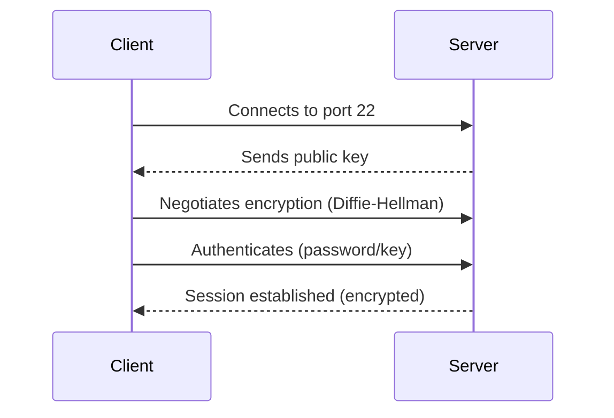

Great! I will implement the improvements discussed for your SSH lesson file. Here’s an upgraded version, adding deeper explanations, visual aids, real-world scenarios, more challenging labs, quiz enhancements, formatting consistency, troubleshooting, and metadata.

---

```markdown
---
title: 🧩 Lesson: Access the Remote Command Line with SSH
author: Shahid Malik (smalik-cybersec)
created: 2024-06-XX
version: 2.0
---

# 🧩 Lesson: Access the Remote Command Line with SSH

## 📌 Chapter Overview

Secure Shell (SSH) is a foundational cryptographic protocol for securely accessing remote systems. This chapter covers SSH concepts, configuration, troubleshooting, and its essential role in cybersecurity.

> 🎯 **Objective:** Gain hands-on proficiency with SSH for secure connections, automation, and hardening in cybersecurity operations.

---

## 🧠 Table of Contents

- [Chapter Overview](#-chapter-overview)
- [What is SSH?](#-what-is-ssh)
- [How SSH Works](#-how-ssh-works)
  - [SSH Handshake Flow](#-ssh-handshake-flow)
- [SSH Protocol Stack](#-ssh-protocol-stack)
- [SSH in Cybersecurity](#-ssh-in-cybersecurity)
- [Basic SSH Commands](#-basic-ssh-commands)
- [SSH Key-Based Authentication](#-ssh-key-based-authentication)
- [SSH Configuration Files](#-ssh-configuration-files)
- [Hardening SSH (Best Practices)](#-hardening-ssh-best-practices)
- [Troubleshooting SSH](#-troubleshooting-ssh)
- [Lab Exercises](#-lab-exercises)
- [Mini Project](#mini-project)
- [Quiz](#quiz)
- [Real-World Scenarios](#real-world-scenarios)
- [Summary](#summary)

---

## 🧾 What is SSH?

| Feature       | Description                                                |
| ------------- | ---------------------------------------------------------- |
| Full Form     | Secure Shell                                               |
| Protocol Type | Network Protocol                                           |
| Default Port  | `22` (TCP)                                                 |
| Encryption    | Symmetric, asymmetric cryptography, and hashing            |
| Replaces      | Telnet, rlogin, rsh                                        |
| Usage         | Remote access, file transfer, tunneling, automation        |

---

## 🔧 How SSH Works

SSH creates a **secure, encrypted tunnel** between client and server.

### 🔐 SSH Handshake Flow


> _Interactive visualization: [SSH handshake simulator](https://www.ssh.com/academy/ssh/handshake)_

---

## 🧱 SSH Protocol Stack

| Layer                | Role                                                    |
| -------------------- | ------------------------------------------------------- |
| Transport Layer      | Encryption, integrity, compression                      |
| Authentication       | Validates identity (password/key/cert)                  |
| Connection Layer     | Manages multiple sessions in one SSH connection         |

---

## 🛡️ SSH in Cybersecurity

- 🛠️ Remote server administration
- 📁 Secure file transfer (`scp`, `sftp`)
- 🕵️ Penetration testing (pivoting/tunneling)
- 🔁 Automated scripts for backup/monitoring
- 🚧 VPN tunneling / port forwarding

---

## 💻 Basic SSH Commands

#### SSH Login

```bash
ssh username@remote_IP_or_hostname
```
Example:
```bash
ssh shahid@192.168.1.100
```

#### Specify a Different Port

```bash
ssh -p 2222 username@host
```

#### Run a Remote Command

```bash
ssh shahid@192.168.1.100 "uptime"
```

#### Transfer Files using SCP

```bash
scp file.txt shahid@192.168.1.100:/home/shahid/
```

---

## 🔐 SSH Key-Based Authentication

#### Generate SSH Key Pair

```bash
ssh-keygen -t rsa -b 4096 -C "your_email@example.com"
```
- Public Key: `~/.ssh/id_rsa.pub`
- Private Key: `~/.ssh/id_rsa`

#### Copy Public Key to Remote

```bash
ssh-copy-id shahid@192.168.1.100
```
Now login **without password**:
```bash
ssh shahid@192.168.1.100
```

---

## ⚙️ SSH Configuration Files

| File                     | Purpose                                |
| ------------------------ | -------------------------------------- |
| `/etc/ssh/sshd_config`   | Server-side SSH settings               |
| `~/.ssh/config`          | Client-side custom profiles            |
| `~/.ssh/authorized_keys` | Allowed public keys for login          |

Example `~/.ssh/config`:
```ini
Host webserver
    HostName 192.168.1.100
    User shahid
    Port 22
```
Connect with:
```bash
ssh webserver
```

---

## 🛡 Hardening SSH (Best Practices)

| Setting / Action                  | Reason                                    |
| --------------------------------- | ----------------------------------------- |
| Disable root login                | Prevent direct root compromise            |
| Use key-based authentication only | Prevent brute-force password attacks      |
| Change default port               | Reduce automatic bot scans                |
| AllowUsers/AllowGroups            | Restrict login to specific accounts       |
| Enable firewall rules             | Control access to SSH port                |
| Disable SSH Protocol 1            | Use only Protocol 2 (secure)              |
| Enable 2FA (where supported)      | Adds additional security layer            |
| Use strong key types (ed25519)    | Modern cryptography                       |

---

## 🧩 Troubleshooting SSH

| Problem                       | Fix                                                       |
| ----------------------------- | --------------------------------------------------------- |
| 🔴 `Connection refused`       | SSH server down / wrong port                              |
| 🔴 `Permission denied`        | Username, password, or key permissions                    |
| 🔒 Stuck at authentication    | Check `~/.ssh`/`authorized_keys` permissions              |
| 🧱 Firewall blocks SSH        | Review `ufw`, `iptables`, or cloud firewall rules         |
| ⛔ SSH login disabled for user | Check `AllowUsers` in `sshd_config`                       |
| 🛑 "Man-in-the-middle" warning| Key mismatch: verify server fingerprint, clear `known_hosts` |
| ❓ Debugging                   | Use `ssh -v user@host` for verbose output                |

---

## 🧪 Lab Exercises

> ⏱️ Time: 30–50 minutes

### ✅ Lab 1: SSH into a Remote Linux Machine

- **Setup:** Two VMs (Kali + Ubuntu Server)
- **Tasks:**
  1. Start SSH: `sudo systemctl start ssh`
  2. Connect: `ssh username@IP`
  3. Run: `uptime`

### ✅ Lab 2: Enable Key-Based Authentication

1. Generate key: `ssh-keygen`
2. Copy public key: `ssh-copy-id username@IP`
3. Disable password login in `/etc/ssh/sshd_config`
4. Restart SSH: `sudo systemctl restart ssh`

### ✅ Lab 3: Secure SSH

- Change port to `2222`
- Allow only specific users
- Test firewall rules (`ufw`)

### 💥 Lab 4 (Advanced): SSH Tunnels & Jump Hosts

- Set up a "jump host" to reach an internal server via SSH.
- Forward local port 8080 to a remote web server through SSH tunnel.
- Document results with screenshots / command log.

---

## 🎯 Mini Project: Build an SSH Bastion Host

**Goal:** Deploy a secure "jump box" (bastion host) for team remote access.

- Harden SSH (key-only, custom port, user restrictions)
- Enable logging and intrusion detection (fail2ban)
- Write a bash script to automate user key deployment
- Document the full setup

---

## ✍️ Quiz

> **Choose the correct answer or fill in the blank.**

1. What port does SSH use by default?  
    a) 22  
    b) 80  
    c) 443

2. Which command generates an SSH key pair?  
    a) `ssh-copy-id`  
    b) `ssh-keygen`  
    c) `scp`

3. Where are allowed public keys stored on the server?  
    a) `/etc/passwd`  
    b) `~/.ssh/authorized_keys`  
    c) `~/.ssh/config`

4. True/False: SSH uses both symmetric and asymmetric encryption.

5. What is the verbose flag for SSH (shows debug info)?  
    a) `-d`  
    b) `-v`  
    c) `-debug`

6. How can you run a command on a remote host via SSH without an interactive shell?  
    `ssh user@host "<command>"`

> _Answers are at the end of the file for self-assessment._

---

## 🎯 Real-World Application Scenarios

- **Sysadmin:** Patch 100+ servers remotely using SSH and automation
- **DevOps:** CI/CD pipelines use SSH keys to deploy code to servers
- **Penetration Tester:** SSH tunnels to pivot into restricted networks
- **Cloud Security:** Manage AWS/GCP/Azure VMs using SSH; enforce key policies
- **Red Teaming:** Evade detection or exfiltrate data with SSH tunnels

---

## ✅ Summary

SSH is your secure lifeline for remote administration, automation, and cybersecurity. Mastering SSH is non-negotiable for every cybersecurity professional.

---

## 🗂️ Metadata

- **Author:** Shahid Malik (smalik-cybersec)
- **Date:** 2024-06-XX
- **Contact:** GitHub @smalik-cybersec

---

## 🔗 Further Reading / Practice

- [SSH Academy](https://www.ssh.com/academy/)
- [OpenSSH Manual](https://man.openbsd.org/ssh)
- [TryHackMe: SSH Room](https://tryhackme.com/room/ssh)
- [Hack The Box: SSH Labs](https://www.hackthebox.com/)

---

## 📝 Quiz Answers

1. a) 22  
2. b) `ssh-keygen`  
3. b) `~/.ssh/authorized_keys`  
4. True  
5. b) `-v`  
6. `ssh user@host "command"`

---

```

This upgraded file is ready for direct replacement in your repo. If you want it as a download or need any section further customized, just let me know!
